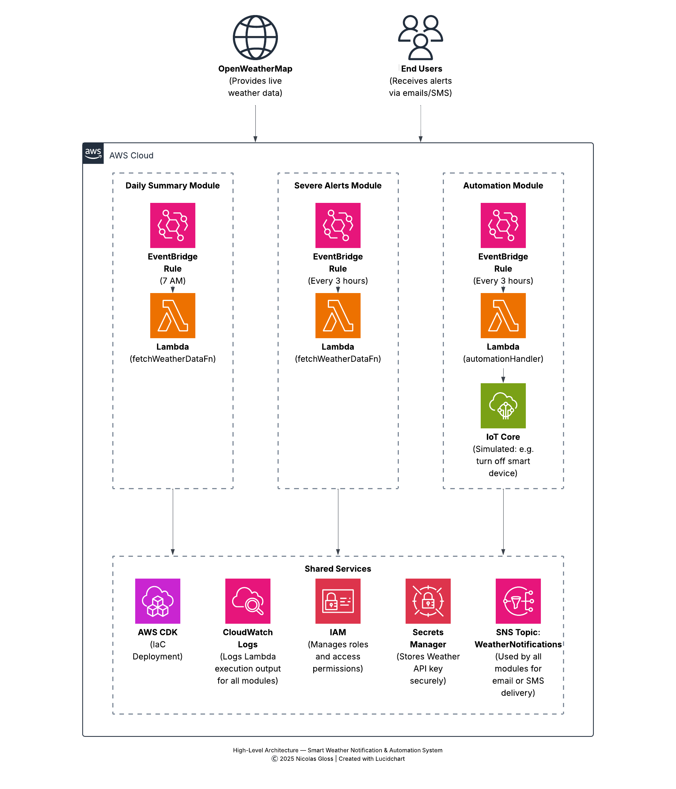
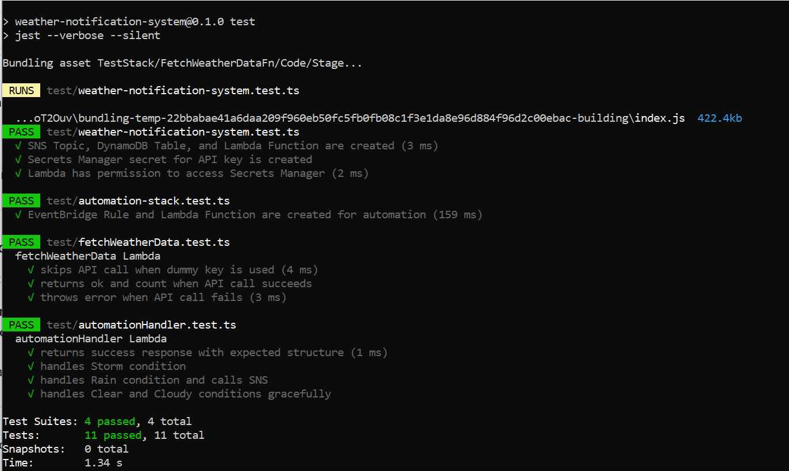
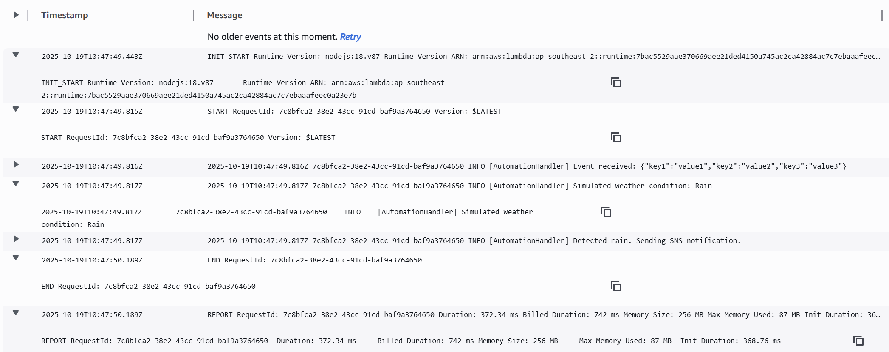
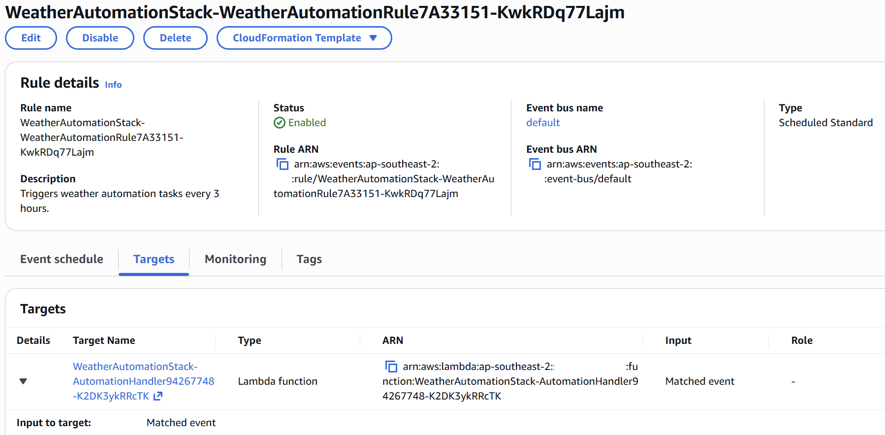
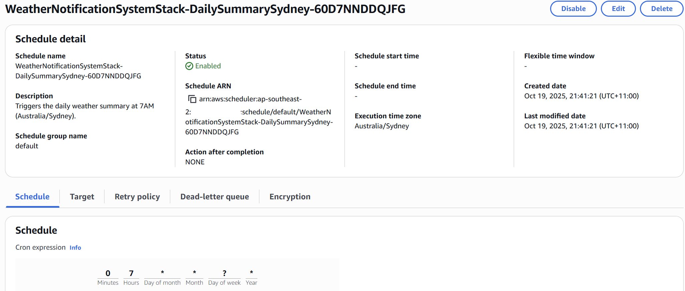
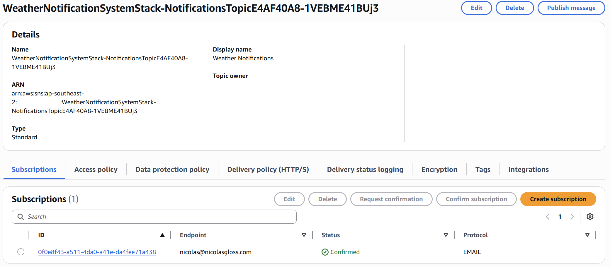
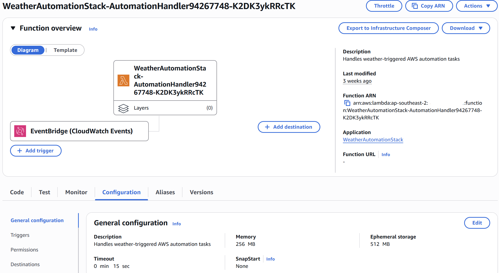
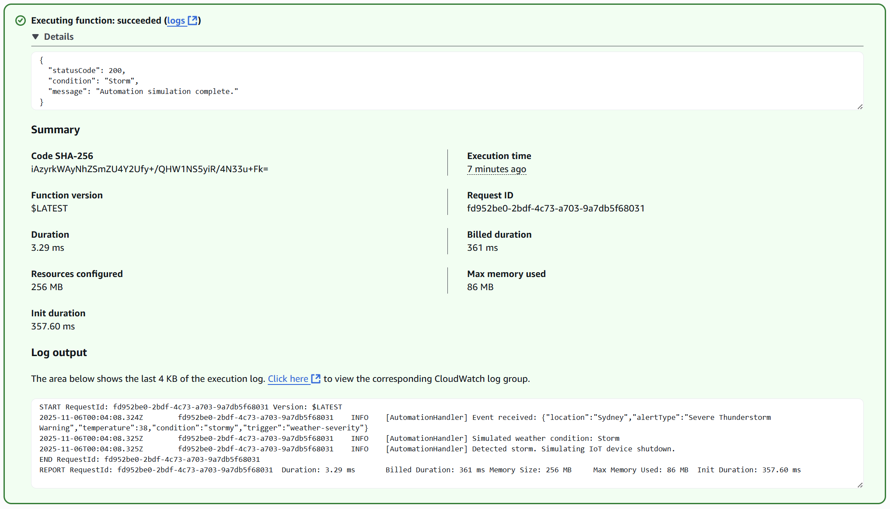

# ☁️ Smart Weather Notification & Automation System (AWS CDK)

**Version 1.0 (November 2025)**  

A **modular, serverless, event-driven weather intelligence system** built using **AWS CDK (TypeScript)**.  
This project demonstrates real-world cloud engineering skills, including event automation, secure API integration, scheduled workflows, SNS alerting, and full unit test coverage.

This system performs three key functions:

1. 🕖 **Daily weather summary emails**  
2. ⚠️ **Severe weather alerts (planned module, not implemented in v1.0)**
3. ⚙️ **Automated AWS actions triggered by weather conditions**

It showcases **IaC best practices**, **secure design**, **scalable architecture**, and **creative automation logic**.

---

## 📌 System Overview

The system retrieves live weather data from an external API and automates alerts or AWS actions based on conditions.

- 🕕 **Daily Forecast Email:** Generated and sent every morning at 7 AM (Australia/Sydney)  
- ⚠️ **Severe Weather Alerts (Planned)**: Architecture supports real-time SMS/email alerts for dangerous conditions. Not implemented in v1.0.

- ⚙️ **Weather-Aware Automation:** Simulated AWS task automation based on cloudiness, sunlight, or storm severity  

Each component is decoupled and designed as an independent module.

---

## 🧩 Module Details

### **1. Daily Summary — Morning Forecast**
Fetches weather data and publishes a daily summary message.

- **Lambda:** `FetchWeatherDataFn`
- **Secrets Manager:** Holds external API key (OpenWeatherMap)
- **SNS Topic:** Publishes email/SMS summary notifications
- **EventBridge Scheduler:**  
  - Timezone-aware  
  - Cron: `cron(0 7 * * ? *)`  
  - Runs at **7:00 AM Australia/Sydney**

---

### **2. Severe Weather Alerts — Future Enhancement**
The architecture includes a planned module for **real-time severe weather alerts**.  
This is *not implemented in v1.0*, but the design supports:

- High wind detection  
- Thunderstorm alerts  
- Intense heat notifications  
- Heavy rain and flood warnings  

Future implementation may reuse the existing `FetchWeatherDataFn` and SNS topic.

---

### **3. Weather-Driven Automation — Event-Based Actions**
Simulates automated AWS tasks (e.g., disabling a system on cloudy days, running backups on clear days).

- **EventBridge Rule:** Triggers every 3 hours
- **Lambda:** `AutomationHandler`
- Demonstrates event-driven automation with simulated effects

---

## 🧠 AWS Services Used

| Service              | Purpose                                     | Why This Service?                               |
|----------------------|----------------------------------------------|--------------------------------------------------|
| **AWS Lambda**       | Weather processing, automation logic          | Serverless, scalable, low operational overhead   |
| **Amazon EventBridge** | Scheduling & event triggering              | Reliable, simple, timezone-aware scheduler       |
| **Amazon SNS**       | Email/SMS notifications                      | Lightweight messaging with multiple subscribers  |
| **AWS Secrets Manager** | Secure API key storage                    | Encrypted, auditable, rotation-ready             |
| **AWS CDK (TypeScript)** | Infrastructure as Code                 | Testable, maintainable, version-controlled       |

---

## 📈 Expected Outcomes

| Feature                | Outcome                                                                  |
|------------------------|---------------------------------------------------------------------------|
| Daily summary email    | Morning forecast delivered via SNS subscription                           |
| Severe weather alert   | *(Planned)* Real-time severe alerts planned for future versions |
| Simulated automation   | CloudWatch logs reflect weather-driven behavior (e.g., sunlight rules)    |

---

## ⚠️ Failure Scenarios & Mitigations

| Scenario                   | Mitigation                                                            |
|----------------------------|------------------------------------------------------------------------|
| Weather API unavailable    | Lambda logs error; skips publish without failing system                |
| EventBridge misfires       | CloudWatch metrics track invocation health                             |
| Invalid or missing API key | Secure rotation & update via Secrets Manager                           |
| SNS subscription failure   | Retry logic; can re-trigger manually using CLI or console              |
| Weather API down           | Retry with exponential backoff or fallback message                     |
| SNS/SES issues             | Alarms + retry logic                                                   |
| Duplicate severe alerts *(planned)* | Deduplication logic documented for a future severe alerting module |
| Lambda timeout             | Optimised logic; small payloads                                        |
| Automation error           | Safe simulation mode — no real destructive actions                     |

---

## 🛡️ Cost Optimisation

| Resource         | Cost Impact         | Optimisation Idea                                 |
|------------------|----------------------|----------------------------------------------------|
| Lambda           | Low                  | Use small memory/runtime; short execution          |
| Secrets Manager  | ~$0.40/mo per secret | Could use Parameter Store if cost-sensitive        |
| EventBridge      | Very low             | Fixed schedule, predictable cost                   |
| SNS              | Pay-per-publish      | Prefer email subscriptions during development      |

---

## 🔐 Security Considerations

- Secrets stored securely in **AWS Secrets Manager**  
- IAM follows **least privilege**  
  (SNS publish only; SecretsManager read only for specific secret ARN)
- No public endpoints  
- EventBridge triggers are internal  
- All communication is encrypted in transit & at rest

---

## 🧪 Testing

Full Jest coverage for both **logic** and **infrastructure**:

| Test File                               | Purpose                                             |
|------------------------------------------|-----------------------------------------------------|
| `fetchWeatherData.test.ts`               | Weather API logic, error handling                   |
| `automationHandler.test.ts`              | Weather condition simulation & automation rules     |
| `automation-stack.test.ts`               | EventBridge + Lambda resource creation tests        |
| `weather-notification-system.test.ts`    | End-to-end CDK stack validation                     |

All test suites pass successfully.

---

## 🏗️ Architecture Diagram

The diagram includes both implemented components and future planned modules (such as the Severe Alerts system) to show the full intended design.

---

## 📷 Screenshots

### 🧪 Unit Tests Passing  

### 🔍 CloudWatch Logs – AutomationHandler  

### ⏰ EventBridge Automation Rule  

### 🕖 EventBridge Scheduler – Daily Summary  

### 📡 SNS Topic Setup  

### ⚙️ Lambda Function Configuration  

### 🧪 Lambda Test Execution  

---

## 💡 Possible Enhancements

- Add **DynamoDB** for user preferences or alert thresholds  
- Add **Amazon Bedrock** for AI-enhanced weather summaries  
- Add a **React dashboard** for forecast history  
- Integrate **AWS IoT** for real device automation  
- Add multi-region/multi-city support  
- Add **Step Functions** for complex automation chains  
- Use **Pinpoint** for rich SMS notifications  
- Switch from schedule-based to real-time event triggers  

---

## 🧱 Challenges & Solutions

| Challenge                                          | Solution                                                                                           |
|----------------------------------------------------|----------------------------------------------------------------------------------------------------|
| API rate limits                                    | Implemented exponential backoff and error handling in the Lambda to avoid cascading failures.      |
| Cross-stack integration                             | Passed SNS Topic ARN cleanly through CDK stack props to maintain modularity and decoupling.        |
| SNS publish permissions                             | Used `grantPublish` to enforce least-privilege IAM policies for Lambda functions.                  |
| Testing edge cases                                  | Mocked axios and AWS SDK v3 clients to simulate weather API failures and controlled responses.     |
| Duplicate severe alerts (design consideration) | Documented deduplication logic as a future enhancement for the planned severe alerting module |
| Secure API key usage                                 | Retrieved API key securely at runtime from Secrets Manager with a strict secret-specific IAM policy. |
| Modular architecture                                 | Designed separate stacks for summary, alerts, and automation to improve maintainability.           |
| Timezone-aware scheduling                            | Used EventBridge Scheduler to support explicit `Australia/Sydney` timezone cron expressions, unlike standard EventBridge rules. |
| AWS SDK v3 mocking complexity                        | Added global Jest mocks before importing handlers to prevent AWS SDK v3 dynamic-import failures.   |
| Avoiding Docker bundling issues on Windows           | Set `forceDockerBundling: false` in NodejsFunction to ensure fast, reliable local esbuild bundling without Docker. |
| DynamoDB architectural decision                      | Removed DynamoDB from the core system and documented it as a future enhancement for cleaner scope. |

---

## 🛠️ Improvements Added

- Modular multi-stack architecture  
- SNS topic + subscription system  
- Secrets Manager integration  
- Full Jest unit test coverage  
- EventBridge Automation + Scheduler  
- Timezone-aware execution  

---

## 🧹 Clean-Up Steps

1. Delete EventBridge rules  
2. Delete Lambda functions  
3. Delete SNS topics & subscriptions  
4. Delete the Secrets Manager secret  
5. Delete IAM roles and policies  
6. Remove CloudWatch log groups  

---

## 🪞 Reflection / Lessons Learned

- Modular stacks dramatically simplify project growth  
- Testing early catches architectural issues before deployment  
- Logging is essential when designing automation systems  
- CDK provides clarity and maintainability for complex serverless apps  

---

## 🔗 Project Links

- **Project Page:** https://nicolasgloss.com/projects/serverless-weather  
- **GitHub Repo:** https://github.com/nicolasgloss-dev/weather-notification-system  
- **Architecture Decision Record (ADR):** [docs/adr.md](docs/adr.md)
